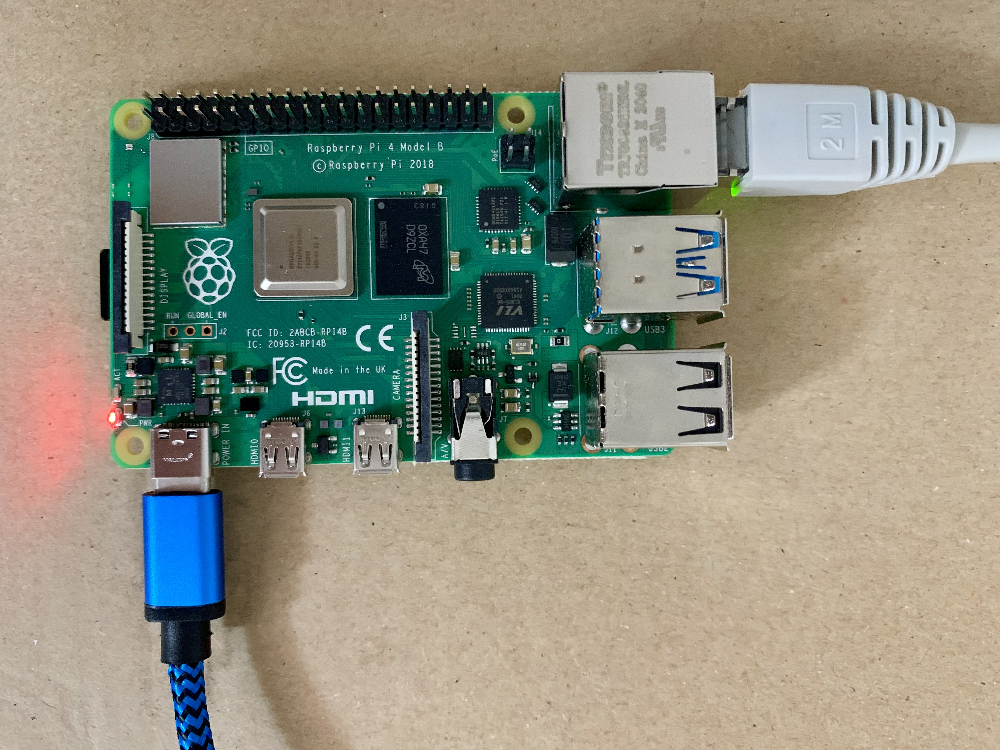

# Project Aether Deployment

This will deploy the following:

- Mosquitto
- Telegraf
- InfluxDB
- Grafana

Mosquitto acts as the MQTT-Broker. Telegraf connects to the Broker and writes the data into the InfluxDB. At the end
Grafana visualizes the data from the InfluxDB.

Also see https://github.com/ric03/aether-microcontroller

## Getting started

1. Enter and encode the passwords for Mosquitto
   ```shell
   $ ./encode-mosquitto-passwd.sh
   ```
2. Enter and configure secrets
   ```shell
   $ ./configure-secrets.sh
   ```
3. Apply terraform
   ```shell
   $ terraform apply -var-file config/secrets.tfvars
   ```
4. Destroy terraform
   ```shell
   $ terraform destroy -var-file config/secrets.tfvars
   ```

## Raspberry Pi Setup



The docker-images used require a 64 bit model.

1. Flash the SD-Card with Ubuntu Server (arm64), [RaspberryPi Imager](https://www.raspberrypi.org/%20downloads/)
2. [Secure the Raspberry Pi](https://www.raspberrypi.com/documentation/computers/configuration.html#securing-your-raspberry-pi)
3. Install Docker: https://docs.docker.com/engine/install/ubuntu/
   ```shell
   # verify installation:
   $ sudo docker version
   $ sudo docker run hello-world
   ```
   It may also be required to install extra modules for raspi (veth.ko missing in kernel)
   ```shell
   $ sudo apt install linux-modules-extra-raspi
   ```
4. Install Terraform:  
   manual download required (terraform does not offer an arm64 package)
   ```shell
   # List of downloads: https://www.terraform.io/downloads.html
   $ wget https://releases.hashicorp.com/terraform/<version>/terraform_<version>.zip`
   $ unzip terraform_<version>.zip
   $ sudo mv terraform /usr/bin/
   # verify installation:
   $ terraform version
   ```
